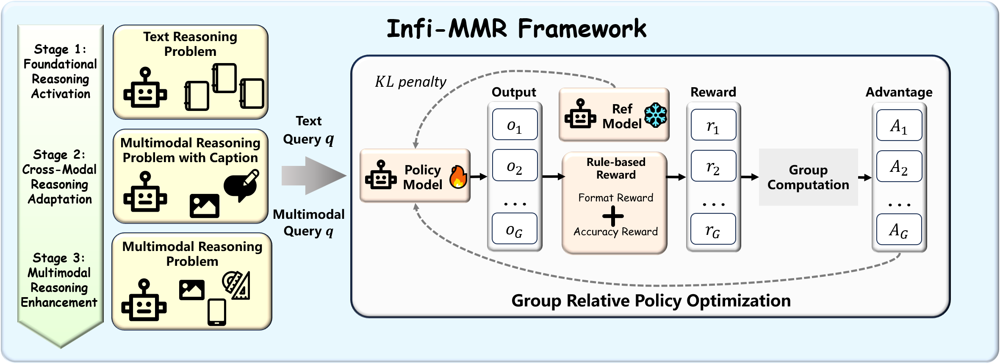

<h1 align="center">
Infi-MMR: Curriculum-based Unlocking Multimodal Reasoning via Phased Reinforcement Learning in Multimodal Small Language Models
</h1>

<p align="center">
  <a href="https://arxiv.org/abs/2505.23091"></a>
  <a href="https://huggingface.co/papers/2505.23091"></a>
  <a href="https://huggingface.co/Reallm-Labs/Infi-MMR-3B"></a>
</p>

<br>
<p align="center">
  <strong>This is the official repository for the paper <a href="https://arxiv.org/abs/2505.23091">Infi-MMR-3B</a>.</strong>
</p>

## 🌟 Overview
In this work, we design a novel framework, **Infi-MMR**, to systematically unlock the reasoning potential of Multimodal Small Language Models (MSLMs) through a curriculum of three carefully structured phases and propose our multimodal reasoning model **Infi-MMR-3B**.

Specially, **Infi-MMR**,  a curriculum-based progressive rule-based RL training framework that unfolds in three distinct phases:
- **Foundational Reasoning Activation** leverages high-quality textual reasoning datasets to activate and strengthen the model’s logical reasoning capabilities.
- **Cross-Modal Reasoning Adaptation** utilizes caption-augmented multimodal data to facilitate the progressive transfer of reasoning skills to multimodal contexts.
- **Multimodal Reasoning Enhancement**  employs curated, caption-free multimodal data to mitigate linguistic biases and promote robust cross-modal reasoning.

<div align="center">
  
  <p><i>Infi-MMR training framework</i></p>
</div>


## 🚀 Updates
- ***`2025/06/03`*** [Model Weights](https://huggingface.co/Reallm-Labs/Infi-MMR-3B) have been uploaded to Hugging Face.
- ***`2025/05/30`*** [Our Preprint](https://arxiv.org/abs/2505.23091) has been published on arXiv.


## 📚 Citation Information

If you find this work useful, citations to the following papers are welcome:

```bibtex
@article{liu2025infimmr,
  title={Infi-MMR: Curriculum-based Unlocking Multimodal Reasoning via Phased Reinforcement Learning in Multimodal Small Language Models},
  author={Zeyu Liu and Yuhang Liu and Guanghao Zhu and Congkai Xie and Zhen Li and Jianbo Yuan and Xinyao Wang and Qing Li and Shing-Chi Cheung and Shengyu Zhang and Fei Wu and Hongxia Yang},
  journal={arXiv preprint arXiv:2505.23091},
  year={2025}
}
```
